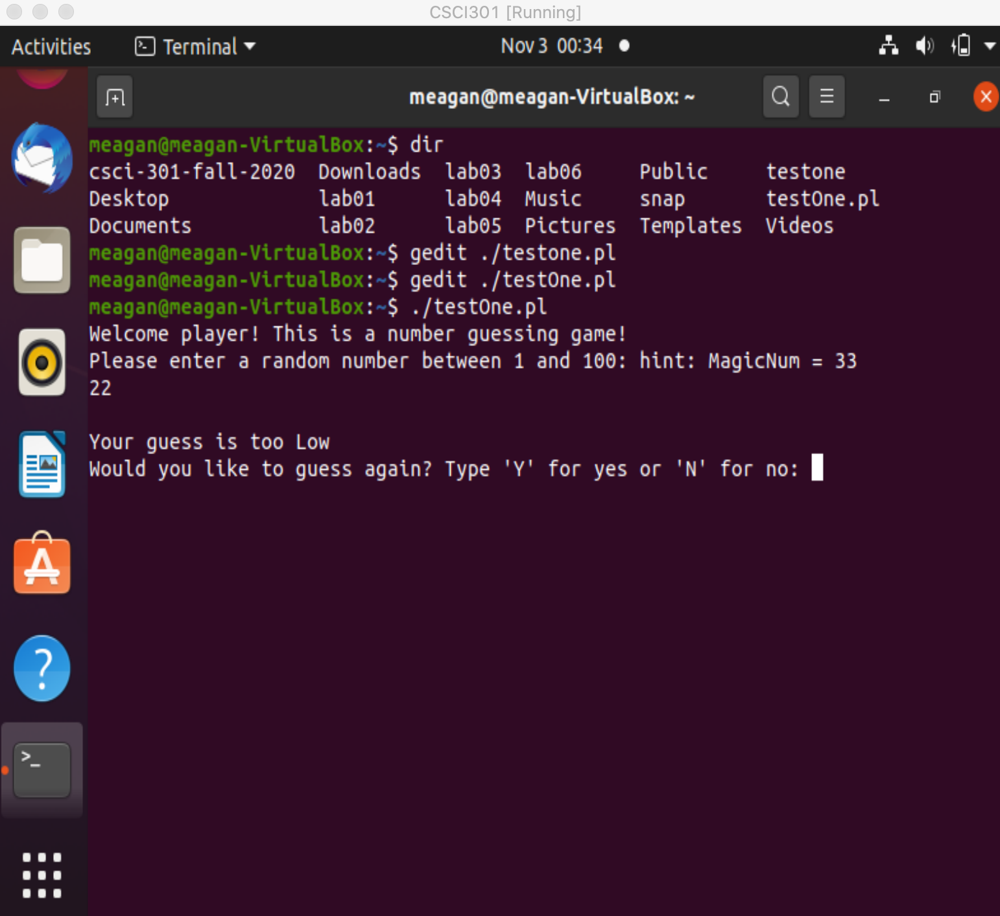
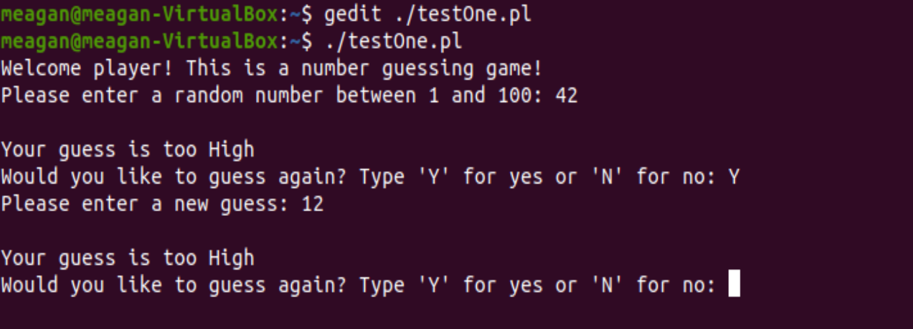
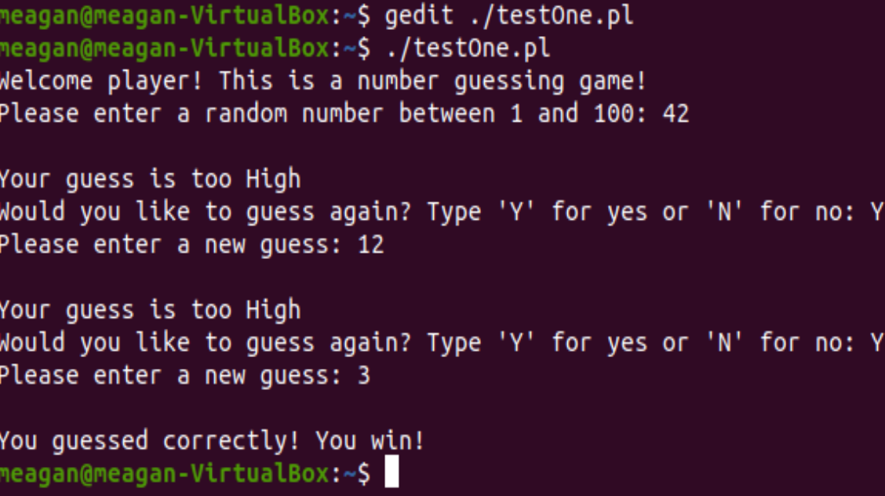

[Back to Portfolio](./)

Guessing Game
===============

-   **Class:CSCI 301** 
-   **Grade: 100**
-   **Language(s): **
-   **Source Code Repository:** [features/mastering-markdown](https://guides.github.com/features/mastering-markdown/)  
    (Please [email me](mailto:mporter@csustudent.net?subject=GitHub%20Access) to request access.)

## Project description
This is a project coded using the perl language. The purpose of this game is to prompt a user to play a guessing game
where a random number is guessed between 1 and 100. The user gets a limited number of tries and is given hints to 
whether their last guess was lower or higher than the random number. They have the option to quit or keep playing during
their limited turns.

## How to compiles / run the program

Using the command line you can open your github repository to correct file.
in this case our file is saved as testOne.pl

cd csci-325-summer-2020
dir
gedit ./testOne.pl (this would be to open the file for editing)
ch mod 755 ./testOne.pl (this allows modification of the file)

to simply run the program with the repository already opened:

./testOne.pl

Fig 1. The code being open, run and tested

Fig 2. Example output after input is processed.

Fig 3. Feedback when the game is won.

For more details see [GitHub Flavored Markdown](https://guides.github.com/features/mastering-markdown/).

[Back to Portfolio](./)

