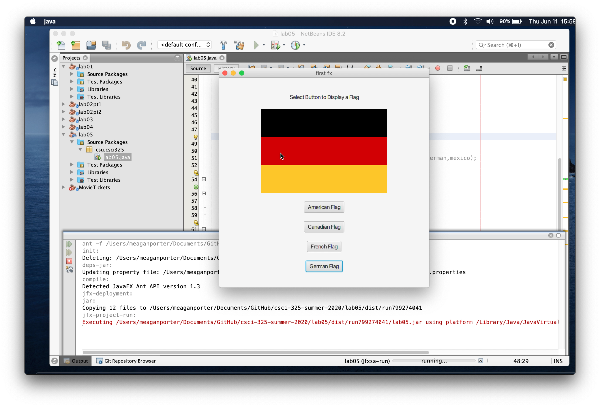

Portfolio
=========

Programming Projects
--------------------

*For access to my private project repositories, please [email me](mailto:example@csustudent.net?subject=GitHub%20Access) with the subject line, GitHub Access.

---
### [User Interface Flag Image | CSCI 301](project1)

---
### [Bowling Game Score Statistics | CSCI 301](project1)

---

Ethics Papers
-------------

### [Ethics Paper](/pdf/sample_presentation.pdf)

-   **Class: CSCI 301**  
-   **Grade: 90**

### [Edward Snowden: The Wikileaks Scandal](/pdf/sample_presentation.pdf)

-   **Class:CSCI 405** 
-   **Grade: 100**

---

Presentations
-------------

### [Target Data Breach](/pdf/sample_presentation.pdf)

- **Class: CSCI 405** 
- **Grade: 100**

---

Page template forked from <a href="https://github.com/csu-cs/csci-portfolio">CSU-CS</a>

<!-- Remove above link if you don't want to attributive -->
