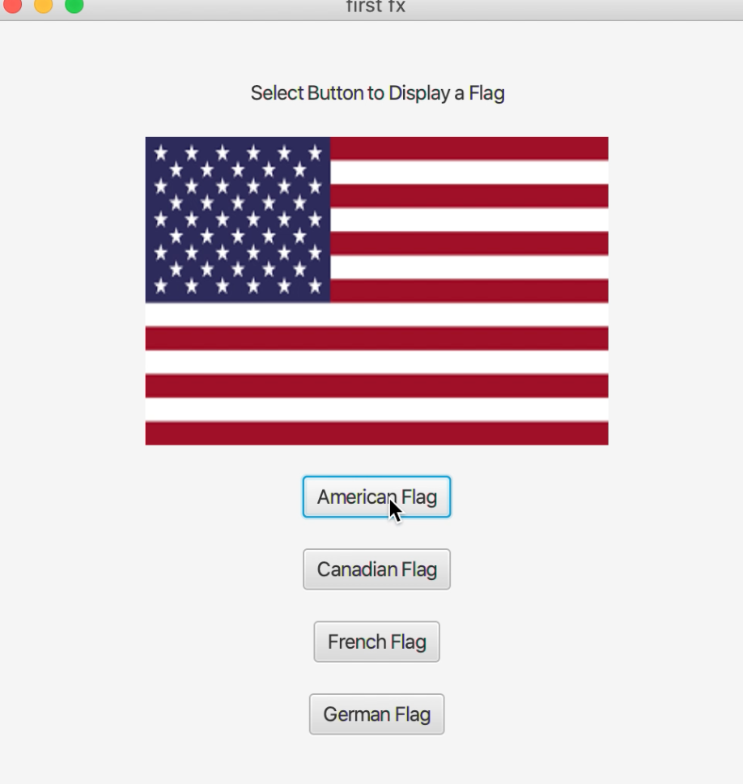
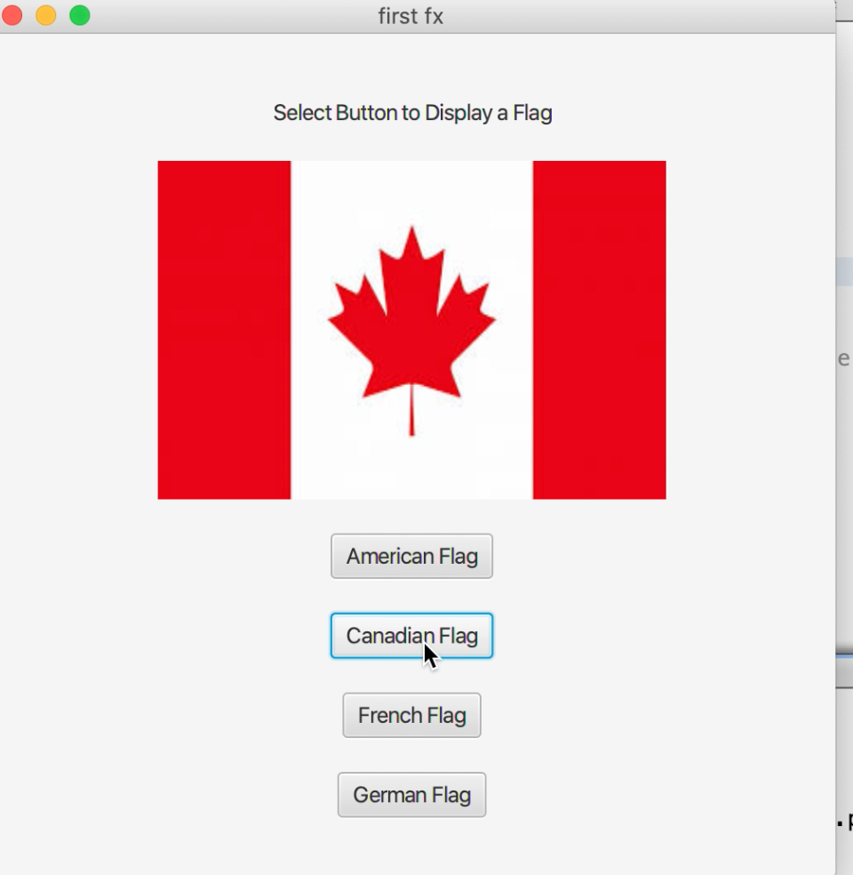
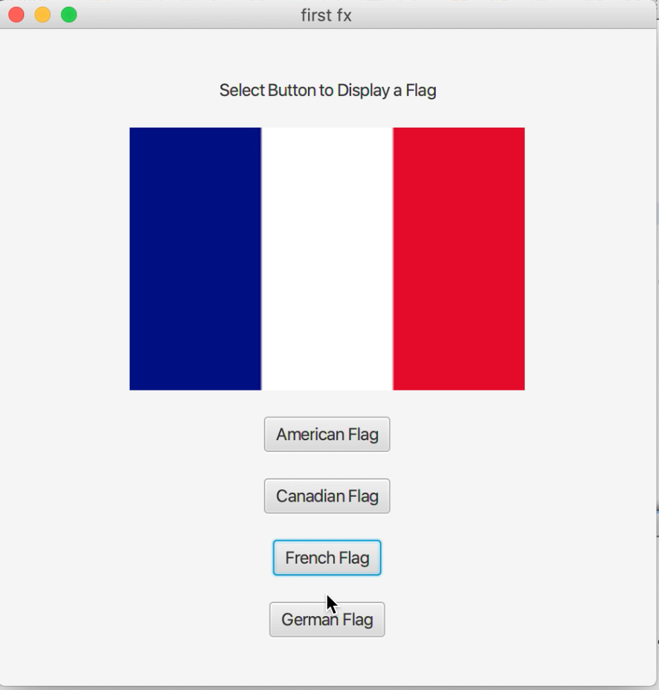
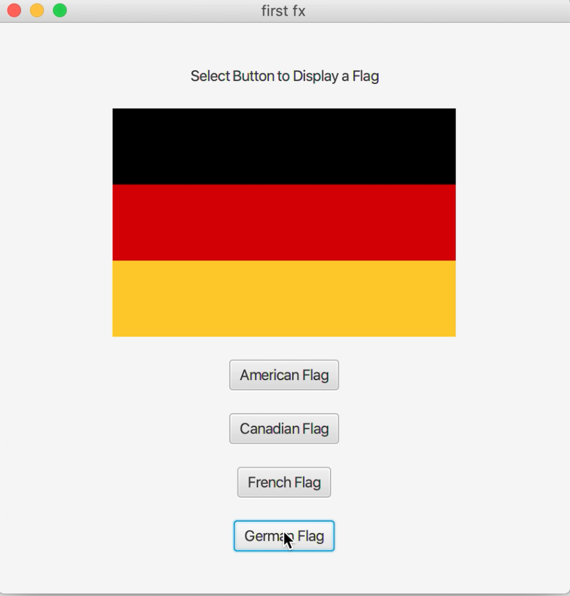

[Back to Portfolio](./)

User Interface Flag Image Project
===============

-   **Class:CSCI 325** 
-   **Grade: 100**
-   **Language(s): Java**
-   **Source Code Repository:** [features/mastering-markdown](https://guides.github.com/features/mastering-markdown/)  
    (Please [email me](mailto:mporter@csustudent.net?subject=GitHub%20Access) to request access.)

## Project description

To purpose of this project was to demonstrate the abilitiy to create a program utilizing user interface object oriented java programming. When the program runs it presents the user with an image box and the option to choose to display four different flag images. Depending on which image is selected, the cooresponding flag image will appear( i.e. United States will display the United States Flag).

## How to compiles / run the program

The project is run using an IDE. It could be opened through a command line or run through the IDE by opening the file, using the IDE to compile and run. 

## UI Design

Fig 1. Image that appears with first pushbutton pressed.

Fig 2. Image that appears with second pushbutton pressed.

Fig 3. Image that appears with third pushbutton pressed.

Fig 3. Image that appears with fourth pushbutton pressed.

## 3. Additional Considerations

Sed ut perspiciatis unde omnis iste natus error sit voluptatem accusantium doloremque laudantium, totam rem aperiam, eaque ipsa quae ab illo inventore veritatis et quasi architecto beatae vitae dicta sunt explicabo. 

For more details see [GitHub Flavored Markdown](https://guides.github.com/features/mastering-markdown/).

[Back to Portfolio](./)
